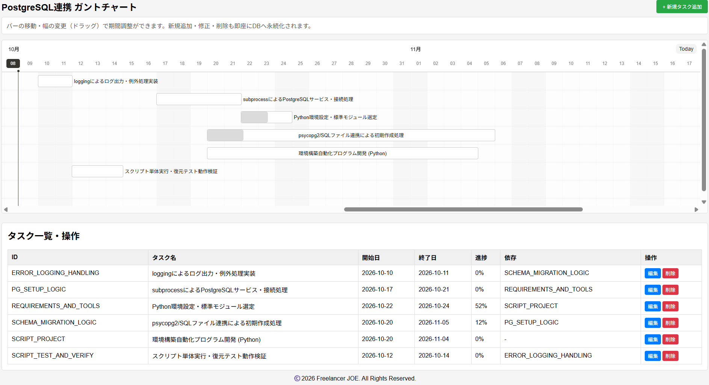

# PostgreSQL-Integrated Gantt Chart

A Gantt chart web application built with React + TypeScript + Frappe Gantt, integrated with PostgreSQL.

The application supports task listing, duration adjustment by dragging, progress updates, task creation, editing, and deletion. Changes are saved to the database through a backend API.

## Main Features

* Retrieve task lists from PostgreSQL
* Display tasks in a Gantt chart
* Day-based view
* Change task duration by dragging task bars
* Change start and end dates by resizing task bars
* Change task progress by dragging
* Add new tasks
* Edit existing tasks
* Delete tasks
* Automatically update task dependencies when a task is deleted
* Display task information in a table
* Display task details in a popup
* Navigate to today's date
* Redraw the Gantt chart after database updates

## Technology Stack

* React
* TypeScript
* Frappe Gantt
* PostgreSQL
* REST API

The frontend uses `frappe-gantt` to render the Gantt chart.

## Data Structure

Tasks are managed using the following structure:

```typescript
type Task = {
  id: string;
  name: string;
  start: string;
  end: string;
  progress: number;
  dependencies?: string;
};
```

* `id`: Task ID
* `name`: Task name
* `start`: Start date (`YYYY-MM-DD`)
* `end`: End date (`YYYY-MM-DD`)
* `progress`: Progress rate (0–100)
* `dependencies`: IDs of dependent tasks. Multiple IDs are separated by commas.

This data structure is defined in `App.tsx`.

## API

The frontend uses the following API:

```text
http://localhost:3001/api/tasks
```

The API base URL is defined in `App.tsx`.

The expected endpoints are:

| HTTP Method | Endpoint         | Description        |
| ----------- | ---------------- | ------------------ |
| GET         | `/api/tasks`     | Retrieve task list |
| POST        | `/api/tasks`     | Create a new task  |
| PUT         | `/api/tasks/:id` | Update a task      |
| DELETE      | `/api/tasks/:id` | Delete a task      |

## Gantt Chart

The Gantt chart is implemented using `Frappe Gantt` with the following settings:

* View unit: Day
* Date format: `YYYY-MM-DD`
* Language: Japanese
* Today button: Enabled
* Move dependent tasks: Enabled
* Task bar height: 30px
* Column width per day: 45px

When the Gantt chart is initialized, tasks retrieved from the API are passed directly to the Gantt chart.

## Changing Task Duration

Dragging a task on the Gantt chart changes its start and end dates.

After the change, the task information displayed on the screen is updated and a `PUT` request is sent to the following API:

```text
PUT /api/tasks/:id
```

Request data:

```json
{
  "start": "YYYY-MM-DD",
  "end": "YYYY-MM-DD"
}
```

This process is implemented using `on_date_change`.

## Changing Progress

The task progress can be changed by dragging the left side of the task bar.

The updated progress is saved to the API in the following format:

```json
{
  "progress": 50
}
```

Progress changes are handled by `on_progress_change`.

## Adding Tasks

New tasks can be added using the **"+ Add New Task"** button.

When creating a new task, the following information can be entered:

* ID
* Task name
* Start date
* End date
* Progress
* Dependencies

The default values are:

* Start date: Today
* End date: Three days after today
* Progress: 0%

## Editing Tasks

Existing tasks can be edited using the **"Edit"** button in the task list.

The selected task information is loaded into the form. When saved, the task is updated using `PUT /api/tasks/:id`.

## Deleting Tasks

Tasks can be deleted using the **"Delete"** button.

When a task is deleted, the application does more than simply remove the task. If other tasks reference the deleted task as a dependency, its ID is automatically removed from their `dependencies` field.

## Screen Layout

A task list table is displayed below the Gantt chart, allowing users to add, edit, and delete tasks.



## Date Handling

Dates are generally handled in the `YYYY-MM-DD` format.

`formatDate()` converts a `Date` object or string into the `YYYY-MM-DD` format.

The application also uses `addDays()` to add a specified number of days to a date.

## Requirements

At minimum, the following environment is required:

* Node.js
* npm
* React
* TypeScript
* Frappe Gantt
* PostgreSQL
* Backend API providing task management endpoints

## Setup Example

### 1. Create the Project

```bash
npm create vite@latest gantt-app -- --template react-ts
cd gantt-app
npm install
```

### 2. Install Frappe Gantt

```bash
npm install frappe-gantt
```

### 3. Add App.tsx

Copy the `App.tsx` from this repository into your React project.

### 4. Start the API Server

Start the backend API server at:

```text
http://localhost:3001
```

The frontend accesses the following endpoint:

```text
http://localhost:3001/api/tasks
```

### 5. Start the React Application

```bash
npm run dev
```

## Application Flow

```text
Browser
   │
   ▼
React / TypeScript
   │
   ├── GET    /api/tasks
   │
   ├── POST   /api/tasks
   │
   ├── PUT    /api/tasks/:id
   │
   └── DELETE /api/tasks/:id
   │
   ▼
Backend API
   │
   ▼
PostgreSQL
```

When the application is first displayed, tasks are retrieved from the API and rendered in the Gantt chart.

After saving or deleting a task, the application retrieves the task list again and redraws the Gantt chart.

## Notes

### API Server

The API URL is currently hard-coded in `App.tsx`:

```typescript
const API_BASE_URL = "http://localhost:3001/api/tasks";
```

When using the application in a production environment or from another PC, change this URL to match the backend API address.

### Date Handling

The current code adds one day to the start and end dates when saving a form:

```typescript
const payload = {
  ...formData,
  start: addDays(formData.start, 1),
  end: addDays(formData.end, 1),
};
```

Therefore, attention should be paid to the relationship between the dates displayed in the frontend and the dates sent to the API.

If the dates shown in the Gantt chart, task table, edit form, and database need to match exactly, the date adjustment logic should be managed consistently with the date specification used by the API.

## Example Project Structure

```text
gantt-app/
├── src/
│   ├── App.tsx
│   ├── App.css
│   └── main.tsx
├── package.json
├── tsconfig.json
└── vite.config.ts
```

## Future Enhancements

* User authentication
* Project-based task management
* Task search and filtering
* Milestone display
* Task reordering
* Automatic scheduling of dependent tasks
* Switching between month / week / day views
* Excel / CSV export
* Task history / change history
* Configurable API URL using environment variables
* One-command startup of the frontend, backend, and PostgreSQL using Docker

## 📄 License & Copyright

This project is released under the [Apache License 2.0](LICENSE).

Copyright (c) 2026 Freelancer JOE. All Rights Reserved.
